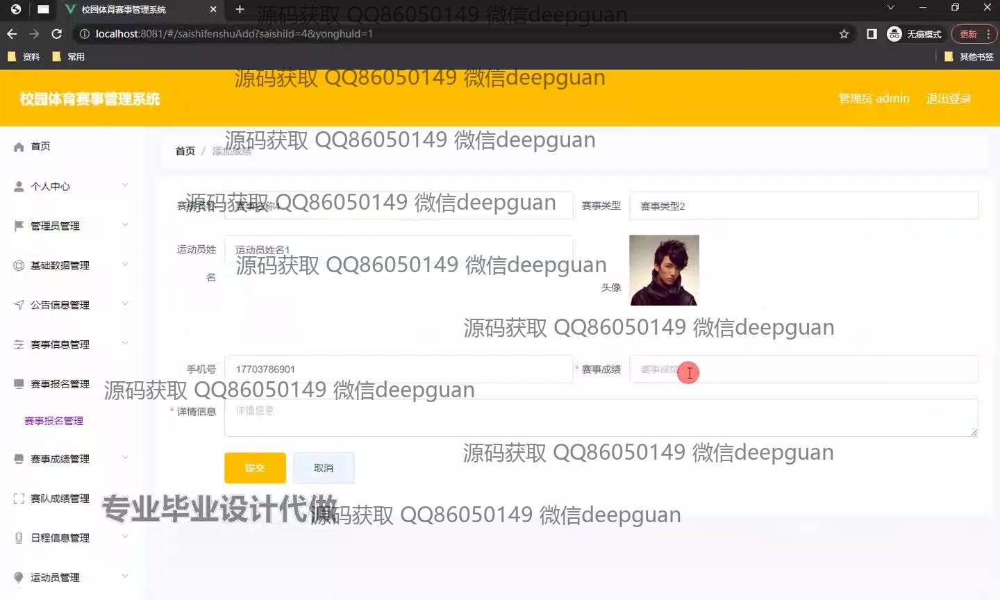
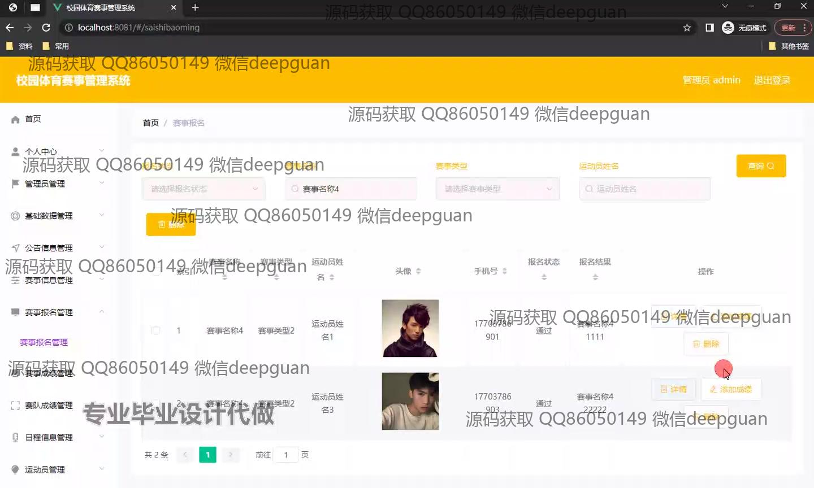
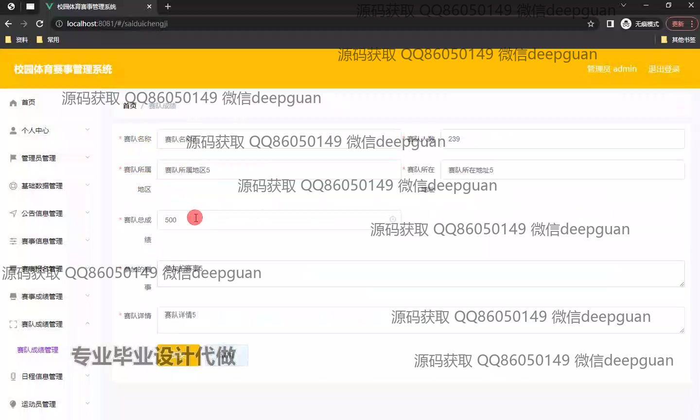

<h1 align="center">校园体育赛事管理系统的设计与实现+vue</h1>

## 简介
校园体育赛事管理系统：角色分为管理员、用户；功能包括赛事信息管理、报名管理、成绩管理、赛队成绩管理、基础数据管理、公示信息管理等。    --计算机毕业设计源码；毕设源码；java毕业设计源码

## 联系方式

<h3 align="center">获取完整代码与数据库文件 + 微信：deepguan QQ: 86050149 QQ群: 783742310</h3>

<h3 align="center">可帮忙远程部署 包运行成功！提供远程部署、修改代码、设计文档指导、代码讲解等服务！</h3>

## 功能介绍（完整见运行截图）
管理员：基本功能包括登录、退出，以及系统设置和用户管理。主要能够管理和查看赛事信息，包括赛事的添加、修改、删除和详细信息查看。可以管理参赛选手信息，如新增、删除以及批量导入/导出参赛选手数据。管理员可以通过数据录入和查询功能来简化管理流程，提供公告信息管理和基础数据管理的模块，并能查看系统数据的可视化图表。个人中心提供管理员对自己账户信息的查看和更改。

运动员：运动员可以通过用户名和密码登录系统，并可以在个人中心查看和修改个人信息。功能模块允许运动员查看赛事信息和比赛日程，提交和管理自己的报名信息，以及查看自己的比赛成绩。运动员还可以查看赛事的公告信息以及相关赛事的详细情况。用户界面支持上传个人资料和信息的更新操作，便于维护个人参与信息的准确性。

审查员：主要职责是审核赛事报名信息，确保参赛者符合赛事要求。通过审核模块，审查员可以查看待审核事项的详细信息，填写审核意见并选择审核状态。在完成审核之后，可以提交意见或取消审核。审核工作旨在保障赛事过程的公正性和高效性。

观众：系统允许没有管理权限的普通用户注册为观众角色，可以查看赛事公开信息，浏览公告和赛事安排，查看参赛队伍和运动员成绩等信息。观众还能够使用系统的查询功能，根据不同条件查找感兴趣的赛事，并获取详细的信息和相关通知。这一角色侧重于提供赛事信息的透明化和获取查找便捷性。

## 运行截图

本代码来源于网络,仅供学习参考使用!

